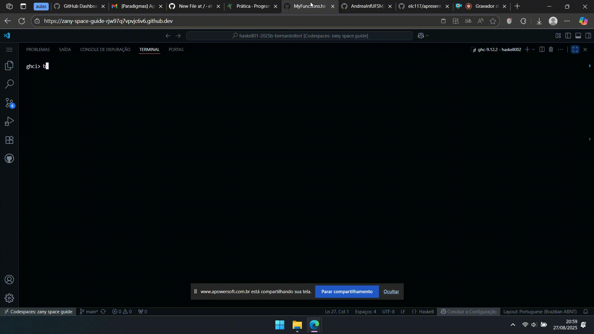
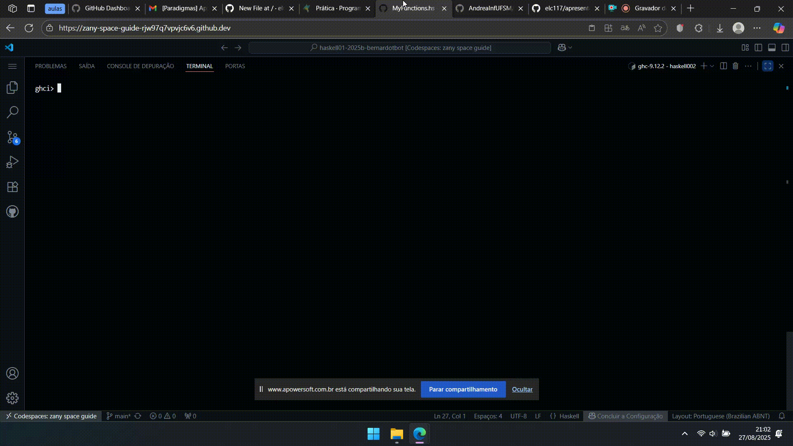

# Resolução de exercícios e HUnit

## Exercício 5
Escreva uma função que receba um número e uma lista de raios de círculos. Essa função deverá retornar somente aqueles raios de círculos cuja área seja maior que o número passado como primeiro argumento. Resolva esta questão usando lambda.



```haskell
bigCircles :: Float -> [Float] -> [Float]
bigCircles area_minima lista_raios = filter (\r -> r * r * pi > area_minima) lista_raios
````

A função recebe uma área mínima e uma lista com valores de raios. Usando o filter e uma função lambda, ela retorna uma lista apenas com os valores que passaram na função lambda.
Minha maior dificuldade foi em como fazer para verificar se a área de cada raio é maior que o número passado como argumento.

## Exercício 6
Escreva uma função que receba uma lista de tuplas com nomes de pessoas e suas temperaturas, e selecione aquelas tuplas que correspondem a pessoas com febre.



```haskell
quarentine :: [(String, Float)] -> [(String, Float)]
quarentine lista = filter (\(_,temperatura) -> temperatura > 37.8) lista
```

Novamente, o filter é usado junto com uma função lambda, dessa vez para testar se a temperatura indica febre ou não.
Achei mais difícil usar o lambda para uma tupla, já que até aqui os exercícios eram resolvidos com o lambda recebendo apenas um número ou char/string como argumento.

Antes da versão final, havia tentado da seguinte maneira:
`quarentine lista = filter (\t -> t > 37.8) lista`
Nesse caso, falta indicar que o que tem dentro da lista é uma tupla e que queremos sempre o segundo elemento dela que representa a temperatura.

## Exercício 8
Escreva uma função que receba uma lista de nomes e adicione o prefixo "Super " às strings que começarem com a letra `A` (maiúscula), deixando as demais inalteradas.


```haskell
superNames :: [String] -> [String]
superNames lista = map (\n -> if head n == 'A' then "Super " ++ n else n) lista
```
A ideia é usar o map de maneira que ele modifique apenas as strings que começarem com 'A'. Para isso, usamos o if para selecionar quando tem que adicionar o "Super " ou deixar a string sem alterações.
A maior dificuldade do exercício é o uso do `if` dentro do map.


## HUnit

O HUnit é um framework usado para automatizar testes em Haskell. Assim, é possível escrever um código que verifica se uma função está funcionando corretamente ao invés de testar manualmente.

### Como instalar
No terminal, rode o seguinte código:
`cabal install HUnit`

### Como rodar
Vamos usar como exemplo o teste de uma função que soma dois valores.
Num arquivo Sum.hs, temos:
```haskell
module Sum where

add :: Int -> Int -> Int
add x y = x + y
```
Para testar o código de soma, temos o arquivo TestSum.hs:
```haskell
module Main where

import Test.HUnit
import Sum (add)

testAdd :: Test
testAdd = TestCase (assertEqual "for (add 1 2)," 3 (add 1 2))

tests :: Test
tests = TestList [TestLabel "testAdd" testAdd]

main :: IO Counts
main = runTestTT tests
```

No trecho acima, foi criada uma função `testAdd` para informar qual é o valor de saída dado dois valores de entrada. Isso é informado depois de `assertEqual "for (add 1 2)"`. O número 3 indica o valor esperado de saída quando a função `add` for chamada com os argumentos 1 e 2.
Vale lembrar que outras verificações podem ser feitas para tornar o teste mais preciso. Isso pode ser feito adicionando outras linhas que seguem o mesmo padrão. Por exemplo:

`testAdd = TestCase (assertEqual "for (add 5 5)," 10 (add 5 5))`

Dando sequência ao código, na linha `tests = TestList [TestLabel "testAdd" testAdd` é criada uma lista de testes. Quando o código for rodado, todas as funções dentro dessa lista serão testadas.

Para rodar os testes, encontrei os seguintes comandos ("tests" representa o nome da lista de testes):

- `cabal tests`
- `runTestTT tests`

No entanto, para mim funcionou o comando mostrado no material das aulas (TestSum.hs é o nome do arquivo de testes):

`runhaskell TestSum.hs`

Os resultados são informados da seguinte maneira ( o `2` representa o número de funções testadas):

`Cases: 2  Tried: 2  Errors: 0  Failures: 0`


## Referências
HASKELL. Test.HUnit. Disponível em: https://hackage.haskell.org/package/HUnit-1.6.2.0/docs/Test-HUnit.html. Acesso em: 27 ago. 2025.

WEBER, Michael (Kinda Technical). Lesson 46: Unit Testing with HUnit. Kinda Technical: A Guide to Learning and Mastering Haskell. Disponível em: https://kindatechnical.com/haskell/lesson-46-unit-testing-with-hunit.html. Acesso em: 27 ago. 2025.

PUTRID PARROT. Unit testing Haskel [sic] code with HUnit. My Memory (blog). Disponível em: https://putridparrot.com/blog/unit-testing-haskel-code-with-hunit/.  Acesso em: 27 ago. 2025

HASKELL. HUnit: A unit testing framework for Haskell. Disponível em: https://hackage.haskell.org/package/HUnit-1.6.0.0#readme. Acesso em: 27 ago. 2025

HASKELL. Debugging and testing in Haskell: Tips and tricks. haskell.dev. Disponível em: https://haskell.dev/article/Debugging_and_testing_in_Haskell_Tips_and_tricks.html. Acesso em: 27 ago. 2025
